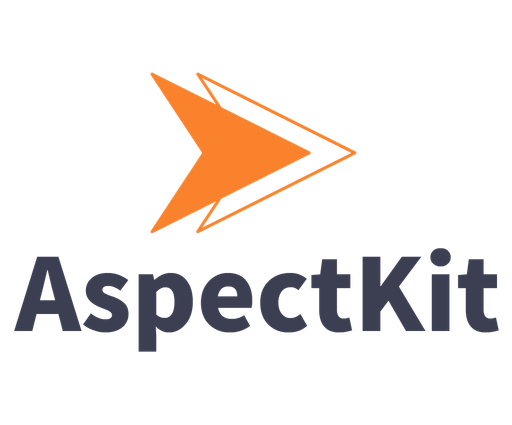

# 

AspectKit is aspect oriented programming support framework that runs directly inside phones, tablets or wearables.


## Installation

### Cocoapods

```ruby
platform :ios, '8.0'
source 'https://github.com/CocoaPods/Specs.git'
use_frameworks!

pod 'AspectKit'
```

### Carthage

```ruby
github "AspectKit/AspectKit"
```

## Requirements

* iOS 8.0+ / Mac OS X 10.9+ / watchOS 2 / tvOS 9.0+
* Xcode 7.0+

## Architecture

### Aspect

### Advice

### Pointcut

### JoinPoint

## Usage

### before advice

### after advice

### around advice

## License

AspectKit is released under the MIT license. See LICENSE for details.
